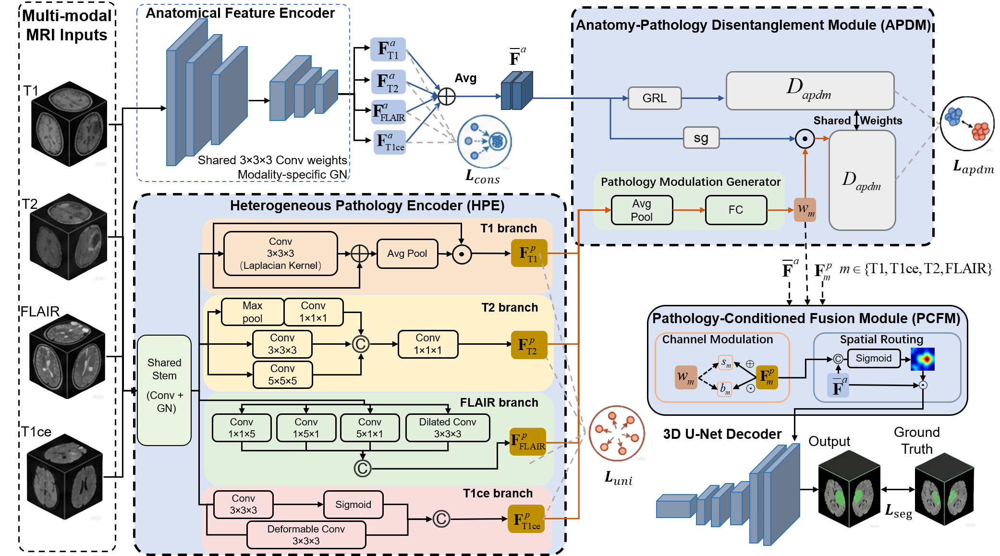
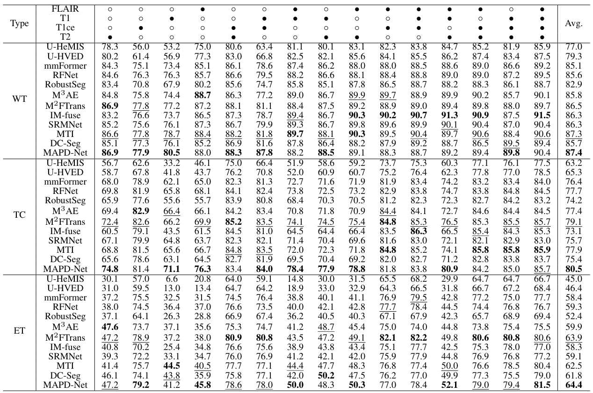
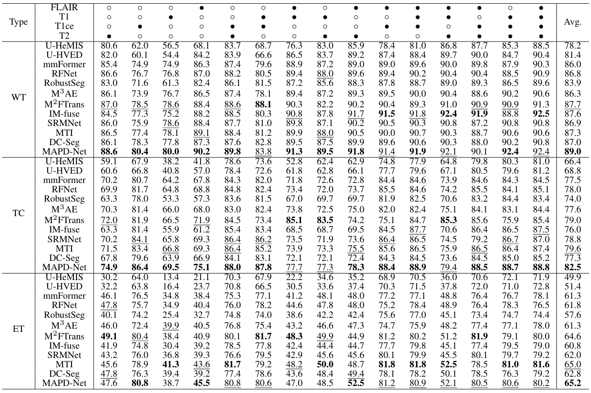
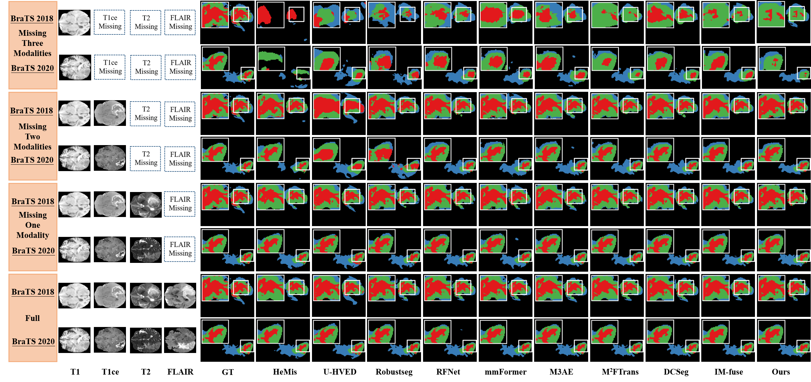

# MAPD-Net: Modality-Aware Anatomy-Pathology Disentanglement for Incomplete Multi-Modality Brain Tumor Segmentation

<div align="center">
<h2>MAPD-Net</h2>
<p align="center">
     <br />
</p>
</div>

## Overview

**MAPD-Net** is a **Modality-aware Anatomy-Pathology Disentanglement Network** for incomplete multi-modality brain tumor segmentation. Multimodal MRI provides complementary anatomical and pathological information, but missing modalities frequently occur in clinical practice and challenge the stability and generalization of segmentation models.

Existing methods mainly rely on modality synthesis, knowledge distillation, or shared representation learning. However, synthesis-based methods may introduce artifacts, distillation-based methods often require separate models for different missing-modality combinations, and shared representation learning may cause semantic entanglement between modality-invariant anatomy and modality-specific pathology.

MAPD-Net addresses this issue by explicitly separating **modality-shared anatomical representations** from **modality-exclusive pathological representations** at the representation level, avoiding pixel-level image reconstruction while preserving discriminative pathological cues.

MAPD-Net consists of three synergistic components:

1. **HPE: Heterogeneous Pathology Encoder**  
   Uses modality-tailored branches to capture distinctive pathological responses from T1, T1ce, T2, and FLAIR images.

2. **APDM: Anatomy-Pathology Disentanglement Module**  
   Promotes explicit feature separation through dual-path adversarial learning and a multi-component disentanglement loss.

3. **PCFM: Pathology-Conditioned Fusion Module**  
   Re-injects pathological priors into the modality-shared anatomical prototype through channel modulation and spatial routing for final segmentation.

---

## Code Availability & Release Plan

This repository currently provides the **review-stage core implementation** of MAPD-Net for academic evaluation. The released version focuses on the proposed architecture and the key anatomy-pathology disentanglement design, including:

- The proposed MAPD-Net architecture and core model components (`modeling/`)
- The implementation of the key modules: **HPE**, **APDM**, and **PCFM**
- Multi-component disentanglement loss functions, including anatomical consistency loss, pathological uniqueness loss, and adversarial semantic constraint loss (`utils/loss.py`)
- Basic quantitative metrics and evaluation utilities (`utils/metrics.py`)
- A lightweight forward verification example with random inputs

At the current submission stage, this repository is intended to allow readers and reviewers to inspect the technical design and verify the core model logic. Complete training configurations, BraTS preprocessing scripts, full dataloader implementation, evaluation pipelines, ablation scripts, and pretrained checkpoints will be released upon paper acceptance.

Due to BraTS data license restrictions, raw datasets are not included.

---

## Content

- (1) [Experimental Results](#1-experimental-results)
- (2) [Project Structure](#project-structure-core-implementation)
- (3) [Notation-to-Code Mapping](#notation-to-code-mapping)
- (4) [Method Components](#method-components)
- (5) [Environment and Dataset Information](#2-environment-and-dataset-information)
- (6) [Forward Verification](#3-forward-verification-core-release)
- (7) [Citation](#citation)

---

## 1 Experimental Results

To comprehensively evaluate the effectiveness and robustness of MAPD-Net for multimodal brain tumor segmentation, we conducted extensive experiments on the **BraTS 2018** and **BraTS 2020** datasets, especially under complex missing-modality scenarios. Following the incomplete multi-modality setting, experiments were performed across **15 possible modality combinations** constructed from four MRI modalities: T1, T1ce, T2, and FLAIR.

The segmentation performance is reported using the Dice coefficient on three clinically significant tumor regions:

- **WT**: Whole Tumor
- **TC**: Tumor Core
- **ET**: Enhancing Tumor

Experimental results demonstrate that MAPD-Net achieves superior segmentation performance compared with state-of-the-art methods in various missing-modality scenarios. The results validate the effectiveness of explicit modality-aware anatomy-pathology disentanglement and show the robustness of MAPD-Net when modalities are missing.

### BraTS 2018 Results

<p align="center">
     <br />
</p>

### BraTS 2020 Results

<p align="center">
     <br />
</p>

### Qualitative Comparison

The qualitative comparison illustrates the segmentation performance of MAPD-Net under representative missing-modality scenarios. MAPD-Net produces segmentation results that are more spatially consistent with the ground truth across different modality combinations. In particular, it better preserves irregular ET boundaries and suppresses false positives when key modalities such as T1ce or FLAIR are unavailable.

<p align="center">
     <br />
</p>

---

## Project Structure (Core Implementation)

```text
.
├── modeling/               # Proposed MAPD-Net architecture
│   ├── HPE.py              # Heterogeneous Pathology Encoder
│   └── ensemble/           # APDM and PCFM core logic
├── utils/                  # Essential utilities
│   ├── loss.py             # Disentanglement losses: L_cons, L_uni, and L_apdm
│   └── metrics.py          # Dice coefficient and basic evaluation metrics
├── figures/                # Architecture, quantitative results, and qualitative comparison
├── mypath.py               # Dataset path configuration template
├── train.py                # Lightweight forward verification entry
├── README.md               # Project documentation
└── requirements.txt        # Environment dependencies
```

---

## Notation-to-Code Mapping

This section maps the main symbols in our paper (Methods / symbol table) to the variables and modules in this core implementation.

**Modality index convention (used in code):** 0 = T1, 1 = T1ce, 2 = T2, 3 = FLAIR.

- `X_m` (input of modality m): input tensor `x` in `train.py` with shape `[B, 4, D, H, W]`; modality slice is `x[:, i:i+1]`.
- `F_m^base` (shared backbone features): `df[i]` returned by the shared UNet backbone.
- `F_m^a` (anatomical features): in this implementation, `df[i]` also serves as the anatomical feature used for prototype computation.
- `F_bar^a` (anatomy prototype): `df_full = mean(df)` in `modeling/ensemble/ensemble.py`.
- `F_m^p` (pathology features from HPE): `p_i = HPE(df[i], modality=i)` in `modeling/HPE.py`.
- `w_m` (pathology modulation parameters): `w_i = SemanticFingerprint(p_i)` (shape `[B, 2*C]`, scale+bias).
- `s_m, b_m` (scale/bias split): `scale, bias = torch.chunk(w_i, 2, dim=1)` and reshape to `[B, C, 1, 1, 1]`.
- `F_m^{a|p}` (FiLM-injected anatomy, training path): `z = df_full.detach() * scale + bias` before the modality discriminator.
- `M_m` (spatial routing mask): `mask = spatial_gate(concat(f_shared, f_pw))` in `FingerprintGuidedFusion`.
- `F_m^e` (enhanced feature after PCFM): `f_shared + mask * f_pw` (per modality), then averaged across available modalities.
- `Y_hat` (segmentation logits): eval returns `final_pred` from `Ensemble.forward`; training may also produce `extra['fused_pred']`.

---

## Method Components

### Heterogeneous Pathology Encoder

The Heterogeneous Pathology Encoder (HPE) employs four distinct, modality-tailored branches after a shared backbone network to extract modality-specific pathological features. Each branch is designed according to the imaging characteristics of the corresponding modality:

- The **T1 branch** leverages the high sensitivity of T1 images to structural gradients and extracts high-frequency edge features.
- The **T2 branch** models the complex heterogeneity within the tumor core through a multi-path structure.
- The **FLAIR branch** captures anisotropic diffusion characteristics of edema using strip convolutions and dilated convolution.
- The **T1ce branch** captures irregular deformations of enhancing regions using intensity gating and deformable convolution.

Through these differentiated extraction strategies, HPE preserves modality-exclusive pathological fingerprints that are crucial for robust segmentation under incomplete multi-modality inputs.

### Anatomy-Pathology Disentanglement Module

The Anatomy-Pathology Disentanglement Module (APDM) is designed to achieve explicit feature-level anatomy-pathology separation. It consists of two adversarial paths:

- The **Anatomical Adversarial Path** uses a Gradient Reversal Layer (GRL) to suppress modal attributes in anatomical features and encourage modality-invariant anatomical representations.
- The **Pathology Modulation Path** encourages modality-exclusive pathological features to retain modality-discriminative information and converts them into pathology modulation parameters.

Together with the multi-component disentanglement loss, APDM constrains anatomical features to be modality-independent while preserving modality-specific pathological semantics.

### Pathology-Conditioned Fusion Module

After disentanglement, the Pathology-Conditioned Fusion Module (PCFM) uses pathology modulation parameters as a conditioning guide to adaptively re-inject modality-specific pathological information into the modality-shared anatomical prototype.

PCFM performs:

- **Channel modulation**, which activates the discriminative power of each modality's pathological features.
- **Spatial routing**, which adaptively determines the effective spatial regions for injecting pathological information.

This pathology-conditioned fusion process maximizes the diagnostic utility of modality-exclusive pathological signals while preserving the integrity of anatomical structures.

---

## 2 Environment and Dataset Information

### 2.1 Environment

The recommended environment is:

- `Python 3.8+`
- `PyTorch 1.10+`
- `CUDA 11.3+`

Install the dependencies as follows:

```bash
# Clone the repository
git clone https://github.com/YourUsername/MAPD-Net.git
cd MAPD-Net

# Install dependencies
pip install -r requirements.txt
```

### 2.2 Dataset Information

The experiments in the paper were conducted on the BraTS 2018 and BraTS 2020 datasets. These datasets contain preoperative multimodal MRI scans from multiple institutions and cover glioma patients with significant morphological and histological heterogeneity.

Each subject includes four MRI modalities:

- T1-weighted (T1)
- Contrast-enhanced T1 (T1ce)
- T2-weighted (T2)
- Fluid-Attenuated Inversion Recovery (FLAIR)

Following the BraTS evaluation protocol, the original annotations are aggregated into three clinically significant regions: Enhancing Tumor (ET), Tumor Core (TC), and Whole Tumor (WT).

Raw BraTS datasets are not included in this repository due to dataset license restrictions. Please download the original datasets from the corresponding data sources:

- [BraTS 2018](https://www.kaggle.com/datasets/anassbenfares/brats2018)
- [BraTS 2020](https://www.synapse.org/#!Synapse:syn27046444/wiki/616571)

The expected BraTS-style subject structure is:

```text
Subject_ID/
├── *_t1.nii.gz
├── *_t1ce.nii.gz
├── *_t2.nii.gz
├── *_flair.nii.gz
└── *_seg.nii.gz
```

**Submission-stage note:** This core release focuses on the proposed architecture and does not include the full dataset preprocessing, dataloader, or evaluation pipeline. These components will be released upon paper acceptance.

---

## 3 Forward Verification (Core Release)

This core release supports lightweight forward verification with random inputs. It is intended to verify the model logic rather than reproduce the full training and evaluation pipeline.

Run:

```bash
python train.py
```

To simulate missing modalities, pass indices in `{0,1,2,3}` corresponding to `{T1, T1ce, T2, FLAIR}`:

```bash
python train.py --missing "1,3"
```

The default input patch size follows the paper setting of `80 × 80 × 80`. For a faster sanity check, a smaller patch size can be used if it is compatible with the network downsampling depth:

```bash
python train.py --patch 48
```

Full training configurations and reproducible training/evaluation scripts will be released after paper acceptance.

---

## Citation

If you find this repository useful for your research, please consider citing our paper:

```bibtex
@article{zhang2026mapd,
  title={MAPD-Net: Modality-Aware Anatomy-Pathology Disentanglement for Incomplete Multi-Modality Brain Tumor Segmentation},
  author={Zhang, Ting and Li, Xiuhan and Liu, Zhaoying},
  journal={},
  year={2026}
}
```
